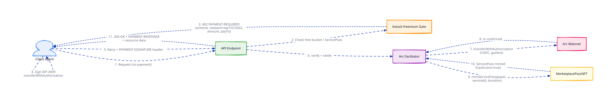

# AgentBadge — Agent Marketplace on Arc

> **Trust & settlement layer for agentic economic activity.** Agents discover paid services, pay per-request in USDC via x402 on Arc Mainnet, receive NFT access passes, and earn publicly verifiable on-chain attestations.

**Live:** [agentbadge.xyz](https://agentbadge.xyz/)
**Article:** [We deployed AgentBadge to Arc Mainnet](https://agentbadge.xyz/blog/arc-c1-mainnet-deployment)
**Full feature docs:** [FEATURES.md](FEATURES.md) — scanner rules, all 65 MCP tools, Hedera/Base rails, B2B layer

---

## Live on Arc Mainnet (chainId 5042)

Not a testnet demo — every link below resolves on the live explorer.

| Contract | Address | Deploy tx |
| --- | --- | --- |
| MarketplacePassNFT | [`0xf8756ce4400c76f1c31b72216c391e1c46cc2c03`](https://explorer.arc.io/address/0xf8756ce4400c76f1c31b72216c391e1c46cc2c03) | [tx](https://explorer.arc.io/tx/0x1253d6a97bb85515e33dff03d2a10e4ecbee65137bcaf708ece76b9a5e3eb97f) |
| AgentPassportNFT | [`0xd226824e66e6aac7104579840506e268886a8169`](https://explorer.arc.io/address/0xd226824e66e6aac7104579840506e268886a8169) | [tx](https://explorer.arc.io/tx/0x84a2efe8b1b1f6d9e0cd97d4696b7ca44a610edb042dc138f0690f716731e247) |
| AgentEventLog | [`0x1bb6A87D18cbd4285b4d383F88f10a1Ed01B4700`](https://explorer.arc.io/address/0x1bb6A87D18cbd4285b4d383F88f10a1Ed01B4700) | [tx](https://explorer.arc.io/tx/0x2dc4d3d7807afc37b09dd5da6f14cd9b73643799fd7ad83493eb1a9cfeebf036) |

| Real x402 payment | Amount | Tx |
| --- | --- | --- |
| Readiness attestation scan | $0.25 USDC | [tx](https://explorer.arc.io/tx/0xc384421cca2cc3e83454145ecd3969e44ee37b78b4bbaf56a204591ac31f1fa1) |
| bstock ServicePass mint | $0.05 USDC | [tx](https://explorer.arc.io/tx/0x463207d0bf2b548df129b58febd792f9323eacf446fcb26e8fe3f0c9f9c79e2f) |
| ERC-8004 attestation write (prod) | — | [tx](https://explorer.arc.io/tx/0xd25ee6371ebb3846ff29b5d61435f15bb6469af739f7bdcc8799e0fb9f6c6796) |

Full transaction log: [`packages/circle-payments/artifacts/mainnet-links.md`](../packages/circle-payments/artifacts/mainnet-links.md)

---

## What runs on Arc

```text
Agent / human client
    │
    ├── POST /api/attestations        ── free 1 req/min, then 402 ($0.25)
    │      → verify + settle EIP-3009 on Arc
    │      → ERC-8004 feedback + memo on-chain
    │
    ├── GET /mcp/bstock/tools         ── bearer + free tier, then 402 ($5)
    │      → verify + settle EIP-3009 on Arc
    │      → mintServicePass → ServicePass NFT (30d access)
    │
    └── MarketplacePassNFT            ── passports, services, passes
           serviceIdFor(1, "bstock-delta-realtime")
           = 0x2ef7218adb1e…b400ffff (registered, active, $5)
```



<details>
<summary>**Why EIP-3009 self-settle?**</summary>

The client signs a `transferWithAuthorization` typed message (EIP-712) — no gas needed. Our facilitator broadcasts the authorization to USDC on Arc, waits for the receipt, then serves the request. Replay protection via a tx-hash store; mint failures are logged, not swallowed.
</details>

---

## Try it

```bash
# 1) Free scan — first request is free
curl -X POST https://agentbadge.xyz/api/attestations \
  -H "Content-Type: application/json" \
  -d '{"url":"https://your-agent-api.com"}'

# 2) Second request → HTTP 402 with PAYMENT-REQUIRED header
#    scheme: eip3009-client-broadcast, network: eip155:5042, asset: USDC

# 3) Pay: sign EIP-3009 transferWithAuthorization → retry with
#    PAYMENT-SIGNATURE header → 200 + PAYMENT-RESPONSE + attestation on-chain
```

---

## Product surface

| Surface | What it is | Status |
| --- | --- | --- |
| **Attestation oracle** | Scan any URL → readiness score → ERC-8004 feedback + memo on Arc | Live on mainnet |
| **x402 paid endpoints** | Attestation ($0.25), bstock feed ($5) — self-settle USDC | Live on mainnet |
| **ServicePass NFTs** | `MarketplacePassNFT` — time-boxed access, `hasAccess` gate | Live on mainnet |
| **Passports** | `AgentPassportNFT` — ERC-8004-compatible agent identity | Live on mainnet |
| **bstock feed** | Realtime market data namespace (`/mcp/bstock/*`) | Live |
| **Venue / jobs board** | ERC-8183 escrow jobs, `/market` hub | Next (SLICE-151-9) |

<details>
<summary>**Roadmap**</summary>

1. **Public venue** — `/market` hub: services, jobs board, attestations, passes tabs. Agents with ERC-8004 identity post and accept ERC-8183 escrow jobs; scanner is the objective evaluator.
2. **Business venues** — AccessPassNFT-gated private marketplaces per company.
3. **Article series C1–C8** — build-log of the Arc integration.
</details>

---

## Repo layout

```text
hackathon/server          ← this app (Hono + Bun + HTMX)
packages/circle-payments  ← x402 facilitator, chains.ts, EIP-3009 handle
packages/bstock-tracker   ← Binance market-data feed behind /mcp/bstock
packages/agent-readiness-scanner ← 138-rule scanner engine
packages/*                ← passport, mcp, database, cache, …
contracts/                ← Solidity (MarketplacePassNFT, AgentPassportNFT, …)
docs/diagrams/            ← D2 → SVG animated diagrams
docs/PAYMENTS/ARC/        ← Arc integration deep-dives
```

## Stack

| Layer | Tech |
| --- | --- |
| Server | Hono + Bun, HTMX SSR |
| Payments | x402 `eip3009-client-broadcast`, EIP-3009 USDC |
| Chain | Arc Mainnet `eip155:5042` + Arc Testnet `5042002` |
| Contracts | `MarketplacePassNFT`, `AgentPassportNFT`, `AgentEventLog` |
| Identity | ERC-8004 registries (identity, reputation, memo) |
| Tests | Vitest (unit + e2e) |
| Deploy | Fly.io → agentbadge.xyz |

## License

Apache-2.0 — see [LICENSE](LICENSE).

> Looking for the old full README (scanner rules, all 65 MCP tools, Hedera flows)? → **[FEATURES.md](FEATURES.md)**
