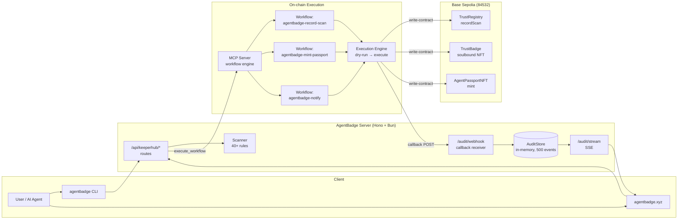
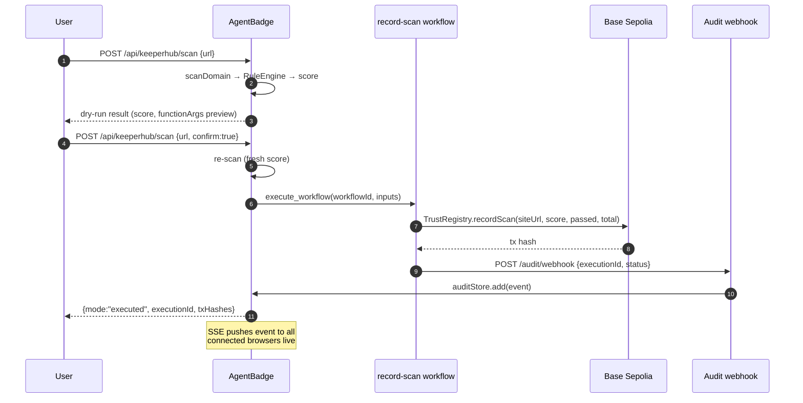
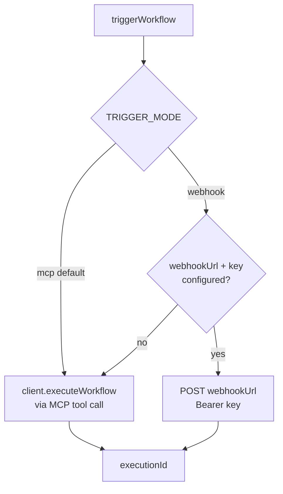
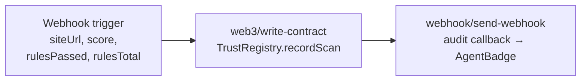
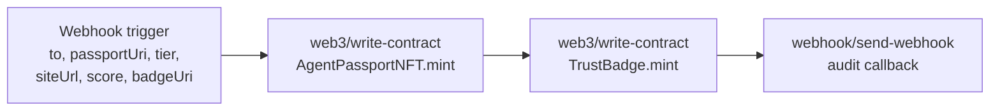
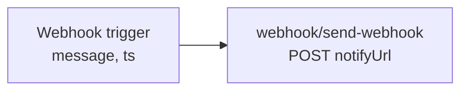
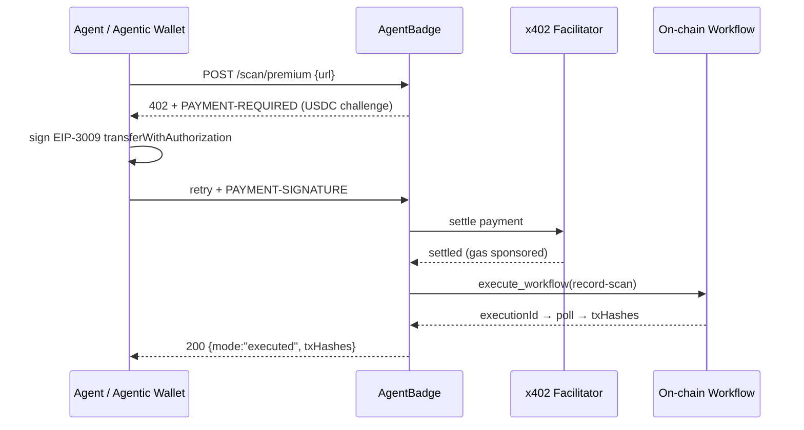
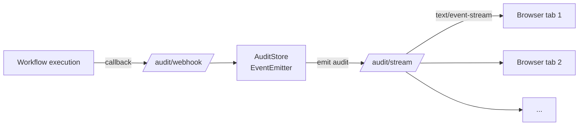

<p align="center">
  
</p>

<h1 align="center">AgentBadge — Onchain Trust Records for AI Agents</h1>

<p align="center">
  <strong>Project Overview for AI Builders Hackathon</strong>
</p>

<p align="center">
  <a href="https://agentbadge.xyz">Live product</a> ·
  <a href="https://agentbadge.xyz/hackathon/ai-builders">Demo page</a> ·
  <a href="https://agentbadge.xyz/api/keeperhub/status">API status</a> ·
  <a href="https://agentbadge.xyz/llms.txt">llms.txt</a> ·
  <a href="https://github.com/agentbadge/agentbadge">GitHub</a><br/>
  <sub>Network: Base Sepolia (84532)</sub>
</p>

AgentBadge is a live product — an agent-readiness scanner that evaluates APIs and websites against 40+ deterministic checks and issues on-chain trust credentials. Scan results are recorded on-chain as permanent, verifiable trust records, and high-scoring sites receive soulbound TrustBadge NFTs.

This document describes the architecture, on-chain workflows, smart contracts, MCP tools, x402 payment flow, and how to verify everything end-to-end.

---

## Table of Contents

1. [What Is AgentBadge](#what-is-agentbadge)
2. [Architecture](#architecture)
3. [On-chain Workflows](#on-chain-workflows)
4. [Smart Contracts](#smart-contracts)
5. [Server API Surface](#server-api-surface)
6. [MCP Tools](#mcp-tools)
7. [x402 Premium Flow](#x402-premium-flow)
8. [Live Audit Trail (SSE)](#live-audit-trail-sse)
9. [Agent Readiness Scanner](#agent-readiness-scanner)
10. [Use Cases](#use-cases)
11. [Code Walkthrough](#code-walkthrough)
12. [How to Verify](#how-to-verify)
13. [Repository Map](#repository-map)
14. [Reliability & Observability](#reliability--observability)

---

## What Is AgentBadge

AI agents are probabilistic by design. When an agent decides "this API is trustworthy," that decision evaporates — there is no durable, verifiable artifact. AgentBadge fixes this with **deterministic scanning + on-chain proof**:

1. **Scan** — 40+ deterministic rules check agent-readiness (MCP compatibility, structured data, AI policies, robots.txt, llms.txt, OpenAPI, pricing, etc.)
2. **Record** — Scan results are written on-chain to `TrustRegistry` on Base Sepolia via a workflow execution
3. **Mint** — Sites scoring ≥ 85 receive a soulbound `TrustBadge` NFT (non-transferable ERC-721)
4. **Verify** — Anyone can independently verify a site's trust record via Basescan or the audit API

| Capability | What it provides |
|---|---|
| 40+ deterministic rules | Objective, reproducible agent-readiness scoring |
| On-chain trust records | Permanent, verifiable scan results on Base Sepolia |
| Soulbound TrustBadge | Non-transferable NFT proof of agent-readiness |
| MCP tools (6) | AI agents can scan, verify, and query trust data programmatically |
| x402 payments | Agents pay per on-chain record via EIP-3009 USDC |
| Live audit trail | Real-time SSE feed of on-chain records |
| Agent Readiness Scanner | Published npm package — CLI + programmatic API |

---

## Architecture

### System diagram



### Sequence: scan → on-chain record



### Dual-path trigger seam



The webhook path exists as a resilience fallback: if the MCP transport is degraded, the same workflow can be triggered through its webhook trigger URL. Mode is switchable by env var — no code change.

---

## On-chain Workflows

Three workflows are provisioned (Base Sepolia, network `"84532"`). Each is built programmatically by the workflow builders in `@agentbadge/keeperhub` and validated before upload.

### 1. `agentbadge-record-scan`

Writes a scan result into `TrustRegistry.recordScan`.



Key detail — `functionArgs` is a **positional array of primitives** (templates resolve before `JSON.parse`, so strings are pre-quoted and numbers bare):

```ts
functionArgs: '["{{Scan Result.siteUrl}}", {{Scan Result.score}}, {{Scan Result.rulesPassed}}, {{Scan Result.rulesTotal}}]'
```

### 2. `agentbadge-mint-passport`

Mints two NFTs in one execution: `AgentPassportNFT` (transferable passport) and `TrustBadge` (soulbound, non-transferable).



### 3. `agentbadge-notify`

Sends scan-event notifications to an external webhook (Discord/Slack/any HTTP endpoint).



---

## Smart Contracts

Deployed on **Base Sepolia (84532)**. Source in `contracts/contracts/` (AgentBadge monorepo).

### TrustRegistry — on-chain scan records

Append-only registry of scan results. The organization wallet holds `RECORDER_ROLE` — only workflow-executed transactions can write.

```solidity
function recordScan(
    string calldata siteUrl,
    uint8 score,
    uint16 rulesPassed,
    uint16 rulesTotal
) external onlyRole(RECORDER_ROLE) returns (uint256 id)
```

- `ScanRecorded` event per record → indexable audit trail
- `REVOKER_ROLE` can revoke a record (e.g., compromised site)
- Positional primitive args — deliberately no structs (workflow `functionArgs` constraint)

### TrustBadge — soulbound NFT

Non-transferable badge bound to the site owner's address. Implemented via an `_update` hook that blocks transfers after minting — the badge can only ever live on the address it was issued to.

### AgentPassportNFT — transferable passport

Standard ERC-721 passport with tier metadata (Bronze/Silver/Gold) and a `passportUri` pointing to the full readiness report.

---

## Server API Surface

All routes live under `/api` (mounted via `app.route("/api", keeperhubApiRoutes)`).

| Method | Path | Purpose |
|---|---|---|
| `GET` | `/api/keeperhub/status` | Config probe — enabled flag, workflow IDs, contract addresses. No network calls |
| `POST` | `/api/keeperhub/ping` | Live connectivity check — calls `list_workflows` on MCP server |
| `POST` | `/api/keeperhub/scan` | **Main flow.** Dry-run by default; `confirm:true` triggers the workflow |
| `POST` | `/api/keeperhub/scan/premium` | Same as `confirm:true` but gated by x402 USDC payment |
| `POST` | `/api/keeperhub/audit/webhook` | Callback receiver for workflow execution results (Bearer-secret validated) |
| `GET` | `/api/keeperhub/audit` | Audit events + optional on-chain enrichment from TrustRegistry |
| `GET` | `/audit/stream` | SSE stream — snapshot on connect, live events, 25s heartbeat, max 40 clients |

Feature-gated: `KEEPERHUB_ENABLED=false` → every route returns `503` with a structured `keeperhubDisabledResponse()` — zero behavior change when off.

---

## MCP Tools

AgentBadge exposes **6 MCP tools** that any MCP-compatible AI agent can call directly. Tools are discovered via `/.well-known/mcp.json` and listed in `llms.txt`.

| Tool | What it does |
|---|---|
| `scan` | Trigger an AgentBadge scan on a URL. Returns scan ID, score, and rule breakdown. Supports dry-run mode (no on-chain tx) |
| `badge` | Check if a site has a TrustBadge NFT. Returns token ID, mint tx, and onchain metadata |
| `passport` | Returns the full agent-readiness passport for a site — all scan results, badges, and trust records in one call |
| `verify` | Verifies an on-chain trust record by tx hash. Returns the scan data stored on-chain for independent verification |
| `score` | Returns the agent-readiness score for a site. Fast lookup without running a full scan |
| `search` | Search across all scanned sites. Filter by score, grade, or readiness criteria |

Tool annotations follow MCP conventions (`readOnlyHint`, `untrustedContentHint`, human-readable `title`).

---

## x402 Premium Flow

`POST /api/keeperhub/scan/premium` demonstrates paid workflow execution via **x402 (EIP-3009 USDC on Base)**.



The free path (`POST /api/keeperhub/scan` with `confirm:true`) always remains available — premium is additive, never a gate.

---

## Live Audit Trail (SSE)

The demo page shows a **live on-chain audit feed** — the first `EventSource` consumer in the codebase.



- Snapshot of last 20 events on connect
- Live `audit` events pushed to all clients
- 25s heartbeat, `X-Accel-Buffering: no`, max 40 concurrent clients
- Dedupe by `executionId + source`, capped at 500 events

---

## Agent Readiness Scanner

The scanner is published as an npm package — **`@agentbadge/scanner`** — usable as both a CLI and a programmatic API.

### CLI

```bash
npx @agentbadge/scanner scan https://example.com
```

Outputs a human-readable report with:
- Overall score (0-100) and grade (A/B/C/D/F)
- Per-rule pass/fail with category grouping
- Recommendations for failed rules

### Programmatic API

```ts
import { getScanResult } from "@agentbadge/scanner";

const result = await getScanResult("https://example.com");
console.log(result.score);    // 87
console.log(result.grade);     // "A"
console.log(result.assertions); // [{ rule_name, status, category, severity }]
```

### Rule categories (40+ rules)

| Category | Rules |
|---|---|
| AI Discovery | `robots.txt` AI bot directives, `llms.txt`, `ai.txt` |
| Structured Data | JSON-LD, Schema.org, OpenGraph meta tags |
| API Surface | OpenAPI spec, `pricing.json`, MCP server descriptor (`/.well-known/mcp.json`) |
| Trust Signals | Owner verification, HTTPS, security headers |
| Agent UX | Error states, empty states, responsive design |

---

## Use Cases

### UC-1 — Scan a site, record the score on-chain

1. Open https://agentbadge.xyz/hackathon/ai-builders
2. Enter a URL → **Run scan** (dry-run: shows score + the exact `functionArgs` that would go on-chain)
3. **Confirm & record onchain** → workflow executes `agentbadge-record-scan`
4. Result card shows execution ID + Basescan tx links
5. The audit feed updates live in any open tab

### UC-2 — Agent-driven recording via MCP

An AI agent calls the `scan` MCP tool with `{url, confirm:true}` — the tool fetches the scan, triggers the workflow, and returns the execution ID. The agent can then poll until a terminal state.

### UC-3 — Paid premium recording (x402)

An agent with an Agentic Wallet hits `/api/keeperhub/scan/premium`, receives a 402 challenge, signs the EIP-3009 authorization, retries, and gets the same executed result — with USDC payment settled by the facilitator.

### UC-4 — Verifying a site's trust history

`GET /api/keeperhub/audit?siteUrl=...&onchain=true` returns local audit events **plus** the latest on-chain record read directly from `TrustRegistry` — anyone can independently verify.

### UC-5 — CLI scanning for CI/CD

```bash
npx @agentbadge/scanner scan https://my-api.com --format json > report.json
```

Developers integrate agent-readiness scanning into CI pipelines — fail the build if score drops below a threshold.

---

## Code Walkthrough

### MCP Client — transport with resilience

`KeeperHubClient` — `@agentbadge/keeperhub` ([npm](https://www.npmjs.com/package/@agentbadge/keeperhub))

```ts
const transport = new StreamableHTTPClientTransport(
  new URL(this.config.serverUrl),
  { requestInit: { headers: { Authorization: `Bearer ${this.config.apiKey}` } } },
);
await this.client.connect(transport);
```

- API key must be an org key (`kh_` prefix) — webhook keys are rejected at construction
- **Idempotency**: every write call merges `idempotency_key` — retries cannot double-execute
- **429 backoff**: exponential retry (up to 5 attempts) honoring `Retry-After`
- **Error normalization**: transport errors → typed `KeeperHubError` with code + retry hints

### Dual-path trigger

`src/server/lib/keeperhub-trigger.ts`

```ts
if (mode === "mcp" || !opts.webhookUrl || !opts.webhookKey) {
  const { executionId } = await client.executeWorkflow(workflowId, inputs);
  return { executionId, via: "mcp" };
}
// webhook fallback — POST to the workflow's webhook trigger URL
```

### Execution + audit recording

`src/server/routes/keeperhub-api.ts` — `executeScanRecording`

```ts
triggerResult = await triggerWorkflow(client, workflowId,
  { siteUrl: normalizedUrl, score: Math.round(scan.score),
    rulesPassed: scan.rulesPassed, rulesTotal: scan.rulesTotal },
  { mode: cfg.keeperhub.triggerMode, webhookUrl, webhookKey });

const exec = await client.pollExecution(triggerResult.executionId,
  { timeoutMs: 300_000, intervalMs: 3000 });

auditStore.add({ source: "agentbadge-record-scan", siteUrl, score,
  status: "recorded", txHashes, executionId });
```

Failures are **not** swallowed: a `failed` audit event is stored and the error is reported to Sentry with route/stage context.

### Workflow spec builder

```ts
config: {
  actionType: "web3/write-contract",
  network: "84532",
  contractAddress: opts.trustRegistryAddress,
  abi: toAbiJson(TRUST_REGISTRY_RECORD_SCAN_ABI),   // JSON.stringify'd string — array → silent 422
  abiFunction: "recordScan",
  functionArgs: '["{{Scan Result.siteUrl}}", {{Scan Result.score}}, ...]',
  gasLimitMultiplier: "1.5",
}
```

Gotchas encoded in the builder (learned from live testing):
- `abi` must be a **string** containing JSON — passing an array fails silently with 422
- `network` is a **string** chain ID (`"84532"`), not a number
- `gasLimitMultiplier` is a **string**
- Template placeholders resolve before `JSON.parse` — strings pre-quoted, numbers bare

### SSRF protection

Every scan target passes `assertSafeTarget(hostname)` — private/reserved IPs are rejected with 403 before any network fetch.

---

## How to Verify

| Check | Command / URL |
|---|---|
| Integration status | `curl https://agentbadge.xyz/api/keeperhub/status` |
| Live MCP connectivity | `curl -X POST https://agentbadge.xyz/api/keeperhub/ping` |
| Dry-run a scan | `curl -X POST .../api/keeperhub/scan -d '{"url":"https://example.com"}'` |
| Audit events | `curl https://agentbadge.xyz/api/keeperhub/audit` |
| SSE stream | `curl -H "Accept: text/event-stream" https://agentbadge.xyz/audit/stream` |
| Demo UI | https://agentbadge.xyz/hackathon/ai-builders |
| On-chain records | TrustRegistry on Basescan (Base Sepolia) |
| llms.txt (agent docs) | https://agentbadge.xyz/llms.txt |
| MCP descriptor | https://agentbadge.xyz/.well-known/mcp.json |

---

## Repository Map

```
src/server/
  routes/keeperhub-api.ts         # /api/keeperhub/* routes (scan, premium, audit, webhook)
  lib/keeperhub.ts                # client singleton + disabled response
  lib/keeperhub-trigger.ts        # dual-path trigger seam (MCP | webhook)
  lib/keeperhub-audit-store.ts    # EventEmitter store, dedupe, 500-cap
  lib/keeperhub-onchain.ts        # TrustRegistry reads (latest score, recent records)

src/mcp/keeperhub-tools.ts        # MCP tools (scan, badge, passport, verify, score, search)
src/views/landing/
  ai-builders-hackathon-page.ts   # demo UI: dry-run → confirm → tx links + live SSE feed

packages/agent-readiness-scanner/ # 40+ rule scanner (CLI + programmatic API)
  src/rules/                      # AB-001..AB-017+ rule implementations
  src/rule-engine/                # StatusDeterminator, RuleEngine
  src/cli/                        # CLI commands (scan, formatters)
  src/index.ts                    # Public API exports

tests/                            # unit + e2e tests
  e2e/keeperhub-flow.test.ts      # full scan → dry-run → execute flow (mocked MCP)
  e2e/keeperhub-live.test.ts      # live-gated test against real MCP server
  helpers/mock-keeperhub-client.ts
```

Smart contracts (`TrustRegistry.sol`, `TrustBadge.sol`, `AgentPassportNFT.sol`) live in the
AgentBadge monorepo — deployed addresses are on Basescan (Base Sepolia).

---

## Reliability & Observability

- **Feature gate**: `KEEPERHUB_ENABLED` — off means every route returns structured 503, zero side effects
- **Never-500 policy**: `ping` and audit endpoints return `{ok:false, error}` instead of throwing
- **Graceful on-chain degradation**: `audit?onchain=true` returns `null` for on-chain fields if the RPC fails — the API still answers
- **Sentry**: every failure path calls `captureError` with route + stage + executionId context
- **Idempotent writes**: `idempotency_key` on every `execute_workflow` call
- **Bounded resources**: audit store capped at 500 events, SSE capped at 40 clients, 25s heartbeat keeps proxies alive
- **SSRF guard**: private/reserved targets rejected before scanning

---

*Built for AI Builders Hackathon, September 2026.*
