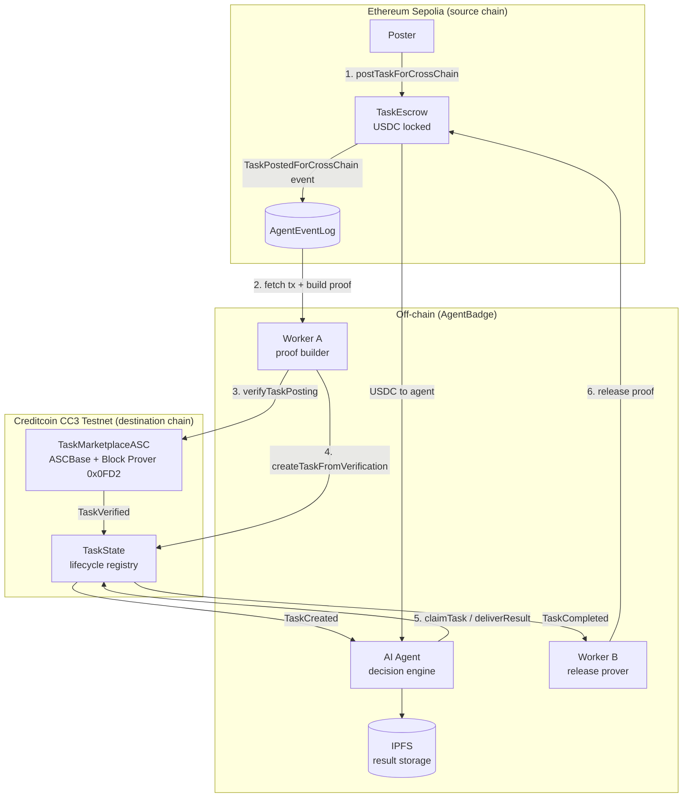
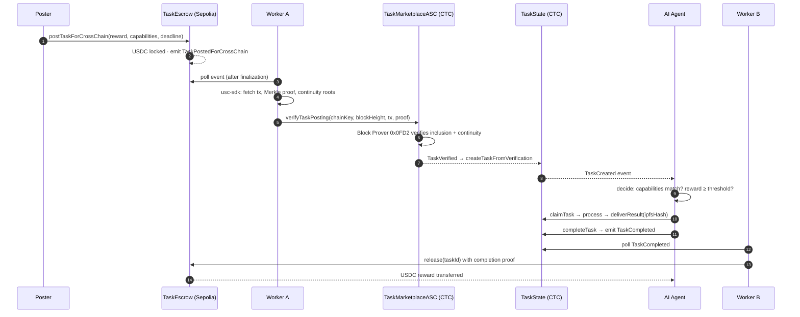
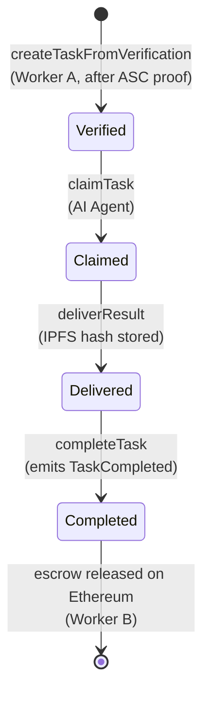

<div align="center">

# Attestcoin — Cross-Chain Verified Task Marketplace for AI Agents

**BUIDL CTC 2026 Fall · Track: AI — "AI apps that process cryptographically verified cross-chain data"**

[Live Demo](https://agentbadge.xyz/hackathon/ctc) · [Demo Video](./demo/ctc-demo.mp4) · [API Status](https://agentbadge.xyz/api/attestcoin/status) · [Submission Doc](./BUIDL-submission.md)

</div>

---

## TL;DR

AI agents can't trust tasks posted on other chains. Attestcoin verifies task authenticity, reward and escrow on Creditcoin via the **Block Prover Precompile (0x0FD2)** — cryptographic proof instead of trusted bridges. An autonomous AI agent then claims the task, delivers the result to IPFS, and Worker B releases the USDC escrow back on Ethereum. **Zero centralized oracles.**

## The Problem

AI agents operating across chains face a trust gap:

- A task posted on Ethereum is invisible to an agent on Creditcoin — there is no native way to confirm it was *really* posted, with the *claimed* reward, by the *claimed* poster.
- Existing bridges and oracle networks introduce trusted intermediaries — a single point of failure and a censorship vector.
- Without verification, an agent can be tricked into working for a reward that was never escrowed.

## The Solution

A cross-chain verified task marketplace where **every step is backed by a cryptographic state proof**:

1. **Post** — a user posts a task on Ethereum Sepolia; the USDC reward is locked in `TaskEscrow` and a `TaskPostedForCrossChain` event is emitted.
2. **Verify** — Worker A builds a Merkle + continuity proof with `@gluwa/usc-sdk` and submits it to `TaskMarketplaceASC` on Creditcoin, which verifies it via the Block Prover Precompile.
3. **Create** — `TaskState.createTaskFromVerification()` materializes the task on Creditcoin with all original parameters.
4. **Deliver** — the autonomous AI agent evaluates the task (capabilities match, reward threshold), claims it, processes it, stores the result in IPFS and marks it delivered.
5. **Release** — Worker B detects `TaskCompleted`, proves it back to Ethereum, and `TaskEscrow.release()` pays the agent in USDC.

## Architecture



## Sequence — One Task End-to-End



## Task Lifecycle (on-chain state machine)



## Smart Contracts

| Contract | Chain | Role | Explorer |
|----------|-------|------|----------|
| `TaskEscrow` | Ethereum Sepolia | Locks USDC reward; emits `TaskPostedForCrossChain`; releases on proven completion; poster can reclaim after 7-day timeout | [Etherscan](https://sepolia.etherscan.io/) |
| `TaskMarketplaceASC` | Creditcoin CC3 | Attestcoin Smart Contract — extends `ASCBase`; verifies source-chain proofs via Block Prover Precompile `0x0FD2`; emits `TaskVerified` | [Blockscout](https://creditcoin-testnet.blockscout.com/) |
| `TaskState` | Creditcoin CC3 | Task lifecycle registry: `None → Verified → Claimed → Delivered → Completed`; stores IPFS result hash | [Blockscout](https://creditcoin-testnet.blockscout.com/) |
| `MockERC20` (USDC) | Ethereum Sepolia | Test USDC for escrow deposits | [Etherscan](https://sepolia.etherscan.io/) |
| `AgentEventLog` | Ethereum Sepolia | Topic-based event log for off-chain indexing | [Etherscan](https://sepolia.etherscan.io/) |

> Deployed addresses: see [deployed-addresses.md](./deployed-addresses.md)

## How Attestcoin Protocol Is Used

Attestcoin is the **core verification layer**, not a bolt-on:

- **`@gluwa/usc-sdk`** — Worker A fetches the Ethereum transaction, block headers, Merkle proof for the `TaskPostedForCrossChain` event, and continuity roots for reorg protection.
- **`TaskMarketplaceASC` extends `ASCBase`** — the canonical Attestcoin pattern: the contract itself performs no business logic beyond decoding the proved transaction and emitting `TaskVerified`.
- **Block Prover Precompile `0x0FD2`** — native Rust precompile on Creditcoin that synchronously verifies Merkle inclusion + chain continuity. Verification completes ~15s after source-chain finalization.
- **Replay protection** — `ASCBase.processedQueries` deduplicates by `queryId = keccak256(chainKey, blockHeight, merkleRoot, siblings)`.
- **Gas cost** — ~0.00003–0.0003 CTC per verification on CC3 testnet.

## Components

### Worker A — Ethereum → Creditcoin

`packages/attestcoin/src/workers/worker-a.ts`

Polls `TaskPostedForCrossChain` on Sepolia → builds proof via `proof-builder.ts` → calls `verifyTaskPosting` → calls `createTaskFromVerification`. Includes a submission queue (`queue.ts`) with retry.

### AI Agent — autonomous decision engine

`packages/attestcoin/src/agent/`

- `agent.ts` — polls `TaskCreated`/`TaskVerified` events on Creditcoin
- `decision.ts` + `decision-queue.ts` — evaluates capabilities match and reward threshold before claiming
- `processor.ts` — executes the task workload
- `ipfs-client.ts` — pins the result, returns the IPFS hash stored on-chain
- `lifecycle.ts` — drives `claim → deliver → complete`

### Worker B — Creditcoin → Ethereum

`packages/attestcoin/src/workers/worker-b.ts`

Polls `TaskCompleted` on Creditcoin → builds the completion proof → calls `TaskEscrow.release(taskId)` on Sepolia → USDC paid to the agent.

## API Surface

Base URL: `https://agentbadge.xyz`

| Method | Path | Description |
|--------|------|-------------|
| GET | `/api/attestcoin/tasks` | List all verified cross-chain tasks |
| GET | `/api/attestcoin/tasks/:taskId` | Single task details (status, claimer, IPFS hash) |
| POST | `/api/attestcoin/verify` | Trigger verification for a Sepolia tx |
| GET | `/api/attestcoin/status` | Integration status + contract config |
| GET | `/hackathon/ctc` | Live demo page (auto-refreshing task list) |

## MCP Tools

Exposed via the AgentBadge MCP server — any MCP-compatible agent can drive the marketplace:

| Tool | Description |
|------|-------------|
| `verify_cross_chain_task` | Verify a cross-chain task posting from Ethereum Sepolia on Creditcoin |
| `list_verified_tasks` | List all cross-chain tasks verified on Creditcoin |
| `get_task_status` | Get detailed status of a cross-chain task |

## Demo

- **Live page:** https://agentbadge.xyz/hackathon/ctc — architecture diagram, live task list (auto-refresh), block explorer links, worker status indicators.
- **Video:** [`demo/ctc-demo.mp4`](./demo/ctc-demo.mp4) — 1920×1080, ~2:30, 26 annotated scenes covering the full lifecycle.
- **Screenshots:** [`demo/screenshots/`](./demo/screenshots/) — all four task states (Verified / Claimed / Delivered / Completed), explorer evidence, worker status.
- **Regenerate:** [`demo/README.md`](./demo/README.md) — `npx tsx capture-screenshots.ts && bash make-video.sh`.

## Verify It Yourself (for judges)

1. Open https://agentbadge.xyz/hackathon/ctc — the task list polls `/api/attestcoin/tasks` live.
2. `curl https://agentbadge.xyz/api/attestcoin/status` — confirms contract wiring and RPC connectivity.
3. `curl https://agentbadge.xyz/api/attestcoin/tasks` — tasks read directly from `TaskState` on Creditcoin.
4. Follow any explorer link on the page — each task row links to its Sepolia posting tx and Creditcoin verification tx.
5. Contracts are verifiable on [Sepolia Etherscan](https://sepolia.etherscan.io/) and [Creditcoin Blockscout](https://creditcoin-testnet.blockscout.com/).

## Repository Map

```
contracts/contracts/
├── TaskEscrow.sol            # USDC escrow + TaskPostedForCrossChain (Sepolia)
├── TaskMarketplaceASC.sol    # ASCBase verifier via Block Prover 0x0FD2 (CTC)
├── TaskState.sol             # Task lifecycle registry (CTC)
└── AgentEventLog.sol         # Event log for indexing

packages/attestcoin/src/
├── sdk/proof-builder.ts      # usc-sdk proof construction
├── workers/worker-a.ts       # Sepolia → Creditcoin verification
├── workers/worker-b.ts       # Creditcoin → Sepolia release
└── agent/                    # Autonomous AI agent (decision, processor, IPFS)

hackathon/server/src/
├── server/routes/attestcoin.ts   # REST API
├── mcp/attestcoin-tools.ts       # 3 MCP tools
└── views/landing/attestcoin-hackathon-page.ts  # Demo UI

docs/HACKATHONS/BUIDL-CTC/
├── BUIDL-submission.md       # Submission text
├── deployed-addresses.md     # Contract addresses
├── demo/                     # Video + screenshots + scripts
└── 01..07-*.md               # Protocol research notes
```

## Stack

- **Contracts:** Solidity 0.8.24, OpenZeppelin, `@gluwa/asc-contracts` (ASCBase, EvmV1Decoder)
- **Cross-chain proofs:** `@gluwa/usc-sdk`, Block Prover Precompile `0x0FD2`
- **SDK / workers / agent:** TypeScript, ethers.js v6
- **Result storage:** IPFS
- **Server:** Hono + Bun, MCP server, live demo UI
- **Chains:** Ethereum Sepolia (11155111) ↔ Creditcoin CC3 Testnet (1020)

## Why This Fits the AI Track

The brief asks for AI apps that *"process cryptographically verified cross-chain data to autonomously inform decisions and trigger on-chain transactions."* That is literally the loop:

- **Verified data in** — the task parameters arrive on Creditcoin only after a Block Prover verification.
- **Autonomous decision** — the agent claims only when capabilities match and the reward clears its threshold.
- **On-chain transactions out** — claim, deliver, complete on Creditcoin; escrow release on Ethereum.

## What's Next

- Mainnet deployment (Ethereum + Creditcoin mainnet)
- Additional source chains (Base, Arbitrum) — same ASC pattern
- Agent reputation from on-chain task completion history
- AgentBadge passport integration for agent identity

---

<div align="center">
Built by the <b>AgentBadge</b> team — agent-native trust infrastructure.<br/>
<a href="https://agentbadge.xyz">agentbadge.xyz</a> · <a href="https://agentbadge.xyz/contact">Contact</a>
</div>
