# Architecture Graph — hackathon/server/src

Generated by `scripts/arch-graph.mts`. Do not edit by hand —
regenerate after structural changes (`bun run arch:graph`). Output is
deterministic: CI fails on any diff (`bun run arch:graph:check`).

```mermaid
flowchart LR
  agent_readiness["agent-readiness"] --> agent_readiness_gap_engine["agent-readiness/gap-engine"]
  agent_readiness["agent-readiness"] --> agent_readiness_rule_engine["agent-readiness/rule-engine"]
  agent_readiness["agent-readiness"] --> agent_readiness_rules["agent-readiness/rules"]
  agent_readiness["agent-readiness"] --> agent_readiness_scoring["agent-readiness/scoring"]
  agent_readiness_badge["agent-readiness/badge"] --> agent_readiness["agent-readiness"]
  agent_readiness_badge["agent-readiness/badge"] --> pkg_cache["pkg: cache"]
  agent_readiness_ci["agent-readiness/ci"] --> agent_readiness_integrity["agent-readiness/integrity"]
  agent_readiness_cli["agent-readiness/cli"] --> agent_readiness["agent-readiness"]
  agent_readiness_cli["agent-readiness/cli"] --> agent_readiness_corpus["agent-readiness/corpus"]
  agent_readiness_cli["agent-readiness/cli"] --> agent_readiness_gap_engine["agent-readiness/gap-engine"]
  agent_readiness_cli["agent-readiness/cli"] --> agent_readiness_integrity["agent-readiness/integrity"]
  agent_readiness_cli["agent-readiness/cli"] --> agent_readiness_profile["agent-readiness/profile"]
  agent_readiness_cli["agent-readiness/cli"] --> agent_readiness_rule_engine["agent-readiness/rule-engine"]
  agent_readiness_cli["agent-readiness/cli"] --> agent_readiness_runtime["agent-readiness/runtime"]
  agent_readiness_cli["agent-readiness/cli"] --> agent_readiness_scanner["agent-readiness/scanner"]
  agent_readiness_cli["agent-readiness/cli"] --> agent_readiness_scoring["agent-readiness/scoring"]
  agent_readiness_cli["agent-readiness/cli"] --> agent_readiness_trust["agent-readiness/trust"]
  agent_readiness_corpus["agent-readiness/corpus"] --> agent_readiness_gap_engine["agent-readiness/gap-engine"]
  agent_readiness_corpus["agent-readiness/corpus"] --> agent_readiness_integrity["agent-readiness/integrity"]
  agent_readiness_corpus["agent-readiness/corpus"] --> agent_readiness_rule_engine["agent-readiness/rule-engine"]
  agent_readiness_corpus["agent-readiness/corpus"] --> agent_readiness_scoring["agent-readiness/scoring"]
  agent_readiness_gap_engine["agent-readiness/gap-engine"] --> agent_readiness["agent-readiness"]
  agent_readiness_gap_engine["agent-readiness/gap-engine"] --> agent_readiness_rule_engine["agent-readiness/rule-engine"]
  agent_readiness_gap_engine["agent-readiness/gap-engine"] --> agent_readiness_scoring["agent-readiness/scoring"]
  agent_readiness_integrity["agent-readiness/integrity"] --> agent_readiness_gap_engine["agent-readiness/gap-engine"]
  agent_readiness_monitoring["agent-readiness/monitoring"] --> agent_readiness["agent-readiness"]
  agent_readiness_profile["agent-readiness/profile"] --> agent_readiness["agent-readiness"]
  agent_readiness_profile["agent-readiness/profile"] --> agent_readiness_rule_engine["agent-readiness/rule-engine"]
  agent_readiness_profile["agent-readiness/profile"] --> agent_readiness_scoring["agent-readiness/scoring"]
  agent_readiness_rule_descriptions["agent-readiness/rule-descriptions"] --> agent_readiness["agent-readiness"]
  agent_readiness_rule_engine["agent-readiness/rule-engine"] --> agent_readiness["agent-readiness"]
  agent_readiness_rule_engine["agent-readiness/rule-engine"] --> agent_readiness_scanner["agent-readiness/scanner"]
  agent_readiness_rule_engine["agent-readiness/rule-engine"] --> pkg_passport["pkg: passport"]
  agent_readiness_rules["agent-readiness/rules"] --> agent_readiness["agent-readiness"]
  agent_readiness_runtime["agent-readiness/runtime"] --> agent_readiness_rule_engine["agent-readiness/rule-engine"]
  agent_readiness_runtime["agent-readiness/runtime"] --> agent_readiness_scanner["agent-readiness/scanner"]
  agent_readiness_scanner["agent-readiness/scanner"] --> agent_readiness["agent-readiness"]
  agent_readiness_scanner["agent-readiness/scanner"] --> pkg_cache["pkg: cache"]
  agent_readiness_scanner["agent-readiness/scanner"] --> pkg_passport["pkg: passport"]
  agent_readiness_scanner["agent-readiness/scanner"] --> server_metrics["server/metrics"]
  agent_readiness_scoring["agent-readiness/scoring"] --> agent_readiness["agent-readiness"]
  agent_readiness_scoring["agent-readiness/scoring"] --> agent_readiness_rule_engine["agent-readiness/rule-engine"]
  agent_readiness_trust["agent-readiness/trust"] --> agent_readiness_profile["agent-readiness/profile"]
  agent_readiness_trust["agent-readiness/trust"] --> agent_readiness_rule_engine["agent-readiness/rule-engine"]
  agent_readiness_trust["agent-readiness/trust"] --> agent_readiness_scanner["agent-readiness/scanner"]
  agents["agents"] --> pkg_hedera_core["pkg: hedera-core"]
  agents["agents"] --> server_lib["server/lib"]
  components["components"] --> server_lib["server/lib"]
  components["components"] --> server_registry["server/registry"]
  mcp["mcp"] --> agent_readiness["agent-readiness"]
  mcp["mcp"] --> agent_readiness_gap_engine["agent-readiness/gap-engine"]
  mcp["mcp"] --> agent_readiness_rule_engine["agent-readiness/rule-engine"]
  mcp["mcp"] --> agent_readiness_scanner["agent-readiness/scanner"]
  mcp["mcp"] --> agent_readiness_scoring["agent-readiness/scoring"]
  mcp["mcp"] --> config["config"]
  mcp["mcp"] --> pkg_circle_payments["pkg: circle-payments"]
  mcp["mcp"] --> pkg_keeperhub["pkg: keeperhub"]
  mcp["mcp"] --> pkg_mcp["pkg: mcp"]
  mcp["mcp"] --> server_lib["server/lib"]
  mcp["mcp"] --> server_routes["server/routes"]
  scripts["scripts"] --> agent_readiness["agent-readiness"]
  server["server"] --> config["config"]
  server["server"] --> pkg_passport["pkg: passport"]
  server["server"] --> server_lib["server/lib"]
  server["server"] --> server_middleware["server/middleware"]
  server["server"] --> server_routes["server/routes"]
  server["server"] --> server_wiring["server/wiring"]
  server["server"] --> verifiers["verifiers"]
  server_lib["server/lib"] --> agent_readiness["agent-readiness"]
  server_lib["server/lib"] --> agent_readiness_integrity["agent-readiness/integrity"]
  server_lib["server/lib"] --> agent_readiness_scoring["agent-readiness/scoring"]
  server_lib["server/lib"] --> agents["agents"]
  server_lib["server/lib"] --> config["config"]
  server_lib["server/lib"] --> pkg_bstock_tracker["pkg: bstock-tracker"]
  server_lib["server/lib"] --> pkg_cache["pkg: cache"]
  server_lib["server/lib"] --> pkg_circle_payments["pkg: circle-payments"]
  server_lib["server/lib"] --> pkg_database["pkg: database"]
  server_lib["server/lib"] --> pkg_evm_core["pkg: evm-core"]
  server_lib["server/lib"] --> pkg_hedera_core["pkg: hedera-core"]
  server_lib["server/lib"] --> pkg_keeperhub["pkg: keeperhub"]
  server_lib["server/lib"] --> pkg_mcp["pkg: mcp"]
  server_lib["server/lib"] --> pkg_passport["pkg: passport"]
  server_lib["server/lib"] --> server_middleware["server/middleware"]
  server_lib["server/lib"] --> server_routes["server/routes"]
  server_lib["server/lib"] --> server_services["server/services"]
  server_lib["server/lib"] --> verifiers["verifiers"]
  server_lib["server/lib"] --> views["views"]
  server_middleware["server/middleware"] --> pkg_cache["pkg: cache"]
  server_middleware["server/middleware"] --> pkg_hedera_core["pkg: hedera-core"]
  server_middleware["server/middleware"] --> pkg_passport["pkg: passport"]
  server_middleware["server/middleware"] --> server_lib["server/lib"]
  server_middleware["server/middleware"] --> server_metrics["server/metrics"]
  server_monitoring["server/monitoring"] --> server_profile["server/profile"]
  server_profile["server/profile"] --> agent_readiness["agent-readiness"]
  server_profile["server/profile"] --> agent_readiness_profile["agent-readiness/profile"]
  server_profile["server/profile"] --> agent_readiness_rule_engine["agent-readiness/rule-engine"]
  server_profile["server/profile"] --> agent_readiness_scoring["agent-readiness/scoring"]
  server_profile["server/profile"] --> server_lib["server/lib"]
  server_profile["server/profile"] --> server_services["server/services"]
  server_routes["server/routes"] --> agent_readiness["agent-readiness"]
  server_routes["server/routes"] --> agent_readiness_corpus["agent-readiness/corpus"]
  server_routes["server/routes"] --> agent_readiness_gap_engine["agent-readiness/gap-engine"]
  server_routes["server/routes"] --> agent_readiness_monitoring["agent-readiness/monitoring"]
  server_routes["server/routes"] --> agent_readiness_profile["agent-readiness/profile"]
  server_routes["server/routes"] --> agent_readiness_rule_engine["agent-readiness/rule-engine"]
  server_routes["server/routes"] --> agent_readiness_scanner["agent-readiness/scanner"]
  server_routes["server/routes"] --> agent_readiness_scoring["agent-readiness/scoring"]
  server_routes["server/routes"] --> agent_readiness_trust["agent-readiness/trust"]
  server_routes["server/routes"] --> components["components"]
  server_routes["server/routes"] --> config["config"]
  server_routes["server/routes"] --> pkg_evm_core["pkg: evm-core"]
  server_routes["server/routes"] --> pkg_hedera_core["pkg: hedera-core"]
  server_routes["server/routes"] --> pkg_mcp["pkg: mcp"]
  server_routes["server/routes"] --> pkg_passport["pkg: passport"]
  server_routes["server/routes"] --> pkg_webmcp["pkg: webmcp"]
  server_routes["server/routes"] --> server["server"]
  server_routes["server/routes"] --> server_lib["server/lib"]
  server_routes["server/routes"] --> server_metrics["server/metrics"]
  server_routes["server/routes"] --> server_middleware["server/middleware"]
  server_routes["server/routes"] --> server_profile["server/profile"]
  server_routes["server/routes"] --> server_registry["server/registry"]
  server_routes["server/routes"] --> server_services["server/services"]
  server_routes["server/routes"] --> views["views"]
  server_services["server/services"] --> data["data"]
  server_services["server/services"] --> pkg_database["pkg: database"]
  server_services["server/services"] --> pkg_hedera_core["pkg: hedera-core"]
  server_services["server/services"] --> pkg_passport["pkg: passport"]
  server_services["server/services"] --> server_lib["server/lib"]
  server_wiring["server/wiring"] --> agent_readiness["agent-readiness"]
  server_wiring["server/wiring"] --> config["config"]
  server_wiring["server/wiring"] --> mcp["mcp"]
  server_wiring["server/wiring"] --> pkg_circle_payments["pkg: circle-payments"]
  server_wiring["server/wiring"] --> pkg_hedera_core["pkg: hedera-core"]
  server_wiring["server/wiring"] --> pkg_mcp["pkg: mcp"]
  server_wiring["server/wiring"] --> pkg_pass_auth["pkg: pass-auth"]
  server_wiring["server/wiring"] --> pkg_passport["pkg: passport"]
  server_wiring["server/wiring"] --> server["server"]
  server_wiring["server/wiring"] --> server_lib["server/lib"]
  server_wiring["server/wiring"] --> server_middleware["server/middleware"]
  server_wiring["server/wiring"] --> server_routes["server/routes"]
  server_wiring["server/wiring"] --> server_services["server/services"]
  server_wiring["server/wiring"] --> telegram["telegram"]
  telegram["telegram"] --> pkg_bstock_tracker["pkg: bstock-tracker"]
  verifiers["verifiers"] --> pkg_hedera_core["pkg: hedera-core"]
  views["views"] --> agent_readiness["agent-readiness"]
  views["views"] --> agent_readiness_gap_engine["agent-readiness/gap-engine"]
  views["views"] --> agent_readiness_monitoring["agent-readiness/monitoring"]
  views["views"] --> agent_readiness_profile["agent-readiness/profile"]
  views["views"] --> agent_readiness_rule_engine["agent-readiness/rule-engine"]
  views["views"] --> agent_readiness_scoring["agent-readiness/scoring"]
  views["views"] --> agent_readiness_trust["agent-readiness/trust"]
  views["views"] --> pkg_hedera_core["pkg: hedera-core"]
  views["views"] --> pkg_mcp["pkg: mcp"]
  views["views"] --> pkg_passport["pkg: passport"]
  views["views"] --> pkg_webmcp["pkg: webmcp"]
  views["views"] --> server_lib["server/lib"]
  views["views"] --> server_registry["server/registry"]
```

- Nodes are top-level modules (`server/routes`, `views`, `agent-readiness/*`, ...).
- `pkg:*` nodes are `@agentbadge/*` packages — dependency direction is
  always server → package, never the reverse.
- 31 modules import across boundaries; 11 packages consumed.
