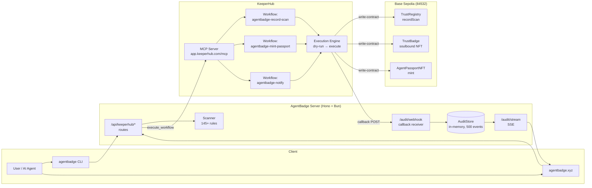
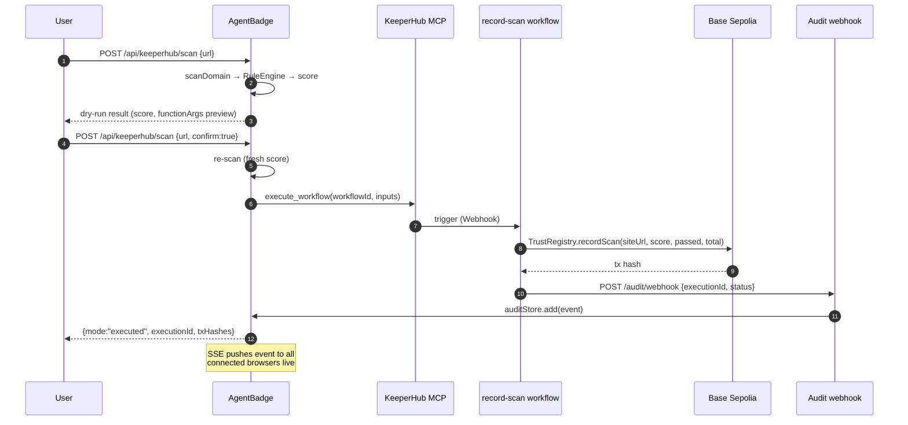
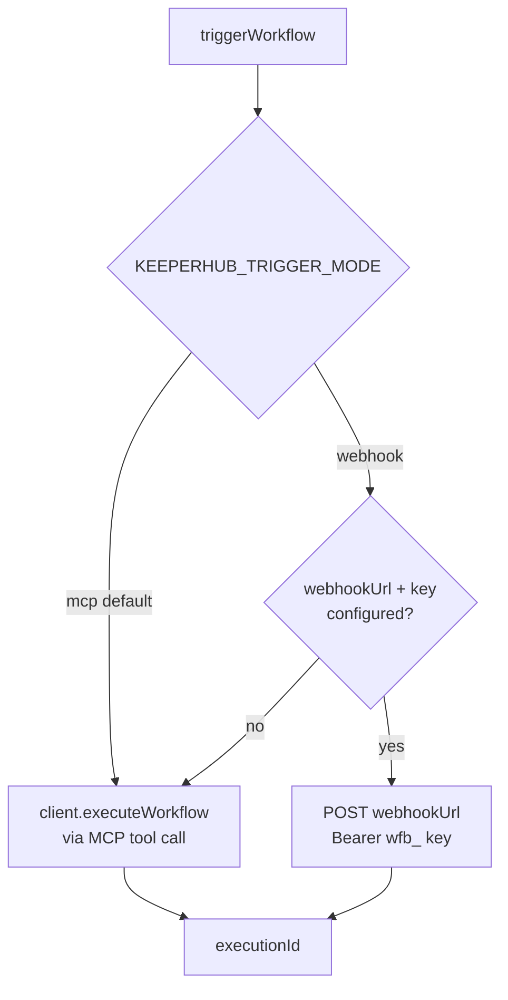
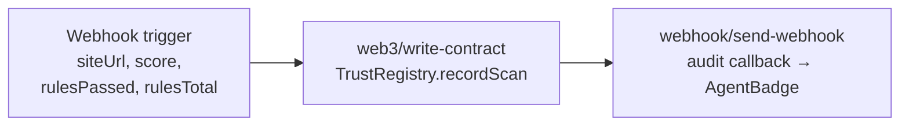
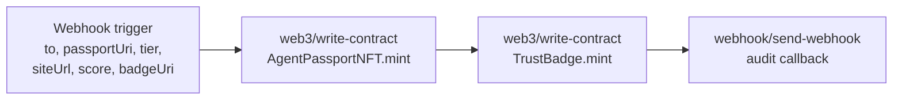
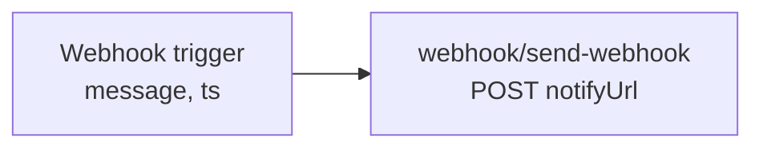
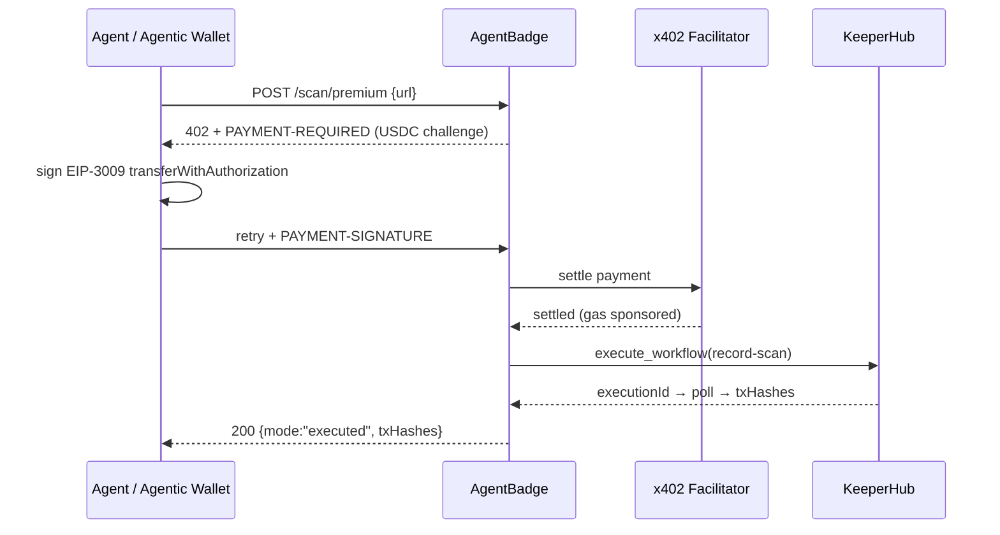
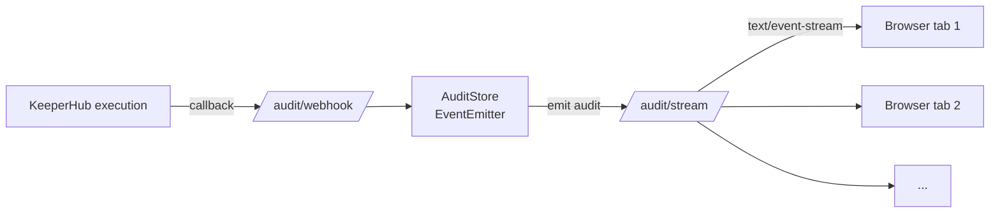

<p align="center">
  
  &nbsp;&nbsp;&nbsp;
  
</p>

<h1 align="center">AgentBadge × KeeperHub</h1>

<p align="center">
  <strong>Integration Overview for Judges</strong><br/>
  <sub>DoraHacks BUIDL · KeeperHub Main Track — The Agent Economy Hackathon</sub>
</p>

<p align="center">
  <a href="https://agentbadge.xyz">Live product</a> ·
  <a href="https://agentbadge.xyz/hackathon/keeperhub">Demo page</a> ·
  <a href="https://agentbadge.xyz/api/keeperhub/status">API status</a> ·
  <a href="https://agentbadge.xyz/llms.txt">llms.txt</a><br/>
  <sub>Network: Base Sepolia (84532)</sub>
</p>

AgentBadge is a live product — an agent-readiness scanner that evaluates APIs and websites against 145+ deterministic checks and issues on-chain trust credentials. **KeeperHub is the deterministic execution layer** that turns every scan result into a verifiable, auditable on-chain record.

This document describes the integration architecture, all KeeperHub surfaces used, the workflows we built, and how to verify everything end-to-end.

---

## Table of Contents

1. [Why This Integration](#why-this-integration)
2. [Architecture](#architecture)
3. [KeeperHub Surfaces Used](#keeperhub-surfaces-used)
4. [Workflows](#workflows)
5. [Smart Contracts](#smart-contracts)
6. [Server API Surface](#server-api-surface)
7. [MCP Tools](#mcp-tools)
8. [x402 Premium Flow](#x402-premium-flow)
9. [Live Audit Trail (SSE)](#live-audit-trail-sse)
10. [Use Cases](#use-cases)
11. [Code Walkthrough](#code-walkthrough)
12. [How to Verify](#how-to-verify)
13. [Repository Map](#repository-map)

---

## Why This Integration

AI agents are probabilistic by design. When an agent decides "this API is trustworthy," that decision evaporates — there is no durable, verifiable artifact. AgentBadge already produces deterministic scan scores; **KeeperHub removes re-interpretation at execution time**: the agent composes a workflow, we dry-run it, review it, and the exact same workflow executes on-chain.

The result: every readiness scan leaves a **cryptographic proof** — a transaction hash on Base Sepolia, recorded in `TrustRegistry`, minted as a soulbound `TrustBadge` NFT, and streamed live to an audit trail.

| KeeperHub capability | What it gives AgentBadge |
|---|---|
| MCP server (40+ tools) | On-chain execution becomes just another tool in our agent pipeline |
| Deterministic execution | Scan → workflow → dry run → exact execution. No agent re-interpretation |
| Audit trail | Every scan leaves an on-chain record with tx hash |
| x402 payments | Paid workflows work out of the box (AgentBadge already speaks x402) |
| Turnkey wallets | Non-custodial, hardware-backed — no private key management |
| Webhook triggers | AgentBadge triggers KeeperHub workflows after scanning |
| Gas sponsorship | Eligible EVM transactions are gas-sponsored |
| Per-workflow MCP | Each workflow is itself an MCP server other agents can call |

---

## Architecture

### System diagram



### Sequence: scan → on-chain record



### Dual-path trigger seam



The webhook path exists as a resilience fallback: if the MCP transport is degraded, the same workflow can be triggered through its webhook trigger URL. Mode is switchable by env var — no code change.

---

## KeeperHub Surfaces Used

| Surface | How we use it | Where |
|---|---|---|
| **MCP server** | `execute_workflow`, `list_workflows`, `get_execution` via `@modelcontextprotocol/sdk` StreamableHTTP transport | `keeperhub-dist/client.js` (source: `packages/keeperhub/src/client.ts` in the monorepo) |
| **Webhooks (trigger)** | Fallback trigger path for `record-scan` workflow | `src/server/lib/keeperhub-trigger.ts` |
| **Webhooks (callback)** | Workflow POSTs execution result back to `/api/keeperhub/audit/webhook` | `src/server/routes/keeperhub-api.ts` |
| **x402** | Premium scan-recording endpoint gated by EIP-3009 USDC payment | `POST /api/keeperhub/scan/premium` |
| **Audit trail** | KeeperHub execution history + our own `AuditStore` + SSE fan-out | `GET /api/keeperhub/audit`, `GET /audit/stream` |
| **Per-workflow MCP** | `agentbadge-record-scan` published — callable as its own MCP tool | KeeperHub marketplace |

---

## Workflows

Three workflows are provisioned on KeeperHub (Base Sepolia, network `"84532"`). Each is built programmatically by `keeperhub-dist/workflows/` and validated before upload.

### 1. `agentbadge-record-scan`

Writes a scan result into `TrustRegistry.recordScan`.



Key detail — `functionArgs` is a **positional array of primitives** (KeeperHub templates resolve before `JSON.parse`, so strings are pre-quoted and numbers bare):

```ts
functionArgs: '["{{Scan Result.siteUrl}}", {{Scan Result.score}}, {{Scan Result.rulesPassed}}, {{Scan Result.rulesTotal}}]'
```

### 2. `agentbadge-mint-passport`

Mints two NFTs in one execution: `AgentPassportNFT` (transferable passport) and `TrustBadge` (soulbound, non-transferable).



### 3. `agentbadge-notify`

Sends scan-event notifications to an external webhook (Discord/Slack/any HTTP endpoint).



---

## Smart Contracts

Deployed on **Base Sepolia (84532)**. Source in `contracts/contracts/` (AgentBadge monorepo).

### TrustRegistry — on-chain scan records

Append-only registry of scan results. The KeeperHub **organization wallet** holds `RECORDER_ROLE` — only KeeperHub-executed workflows can write.

```solidity
function recordScan(
    string calldata siteUrl,
    uint8 score,
    uint16 rulesPassed,
    uint16 rulesTotal
) external onlyRole(RECORDER_ROLE) returns (uint256 id)
```

- `ScanRecorded` event per record → indexable audit trail
- `REVOKER_ROLE` can revoke a record (e.g., compromised site)
- Positional primitive args — deliberately no structs (KeeperHub `functionArgs` constraint)

### TrustBadge — soulbound NFT

Non-transferable badge bound to the site owner's address. Implemented via an `_update` hook that blocks transfers after minting — the badge can only ever live on the address it was issued to.

### AgentPassportNFT — transferable passport

Standard ERC-721 passport with tier metadata (Bronze/Silver/Gold) and a `passportUri` pointing to the full readiness report.

---

## Server API Surface

All routes live under `/api` (mounted via `app.route("/api", keeperhubApiRoutes)`).

| Method | Path | Purpose |
|---|---|---|
| `GET` | `/api/keeperhub/status` | Config probe — enabled flag, workflow IDs, contract addresses. No network calls |
| `POST` | `/api/keeperhub/ping` | Live connectivity check — calls `list_workflows` on KeeperHub MCP |
| `POST` | `/api/keeperhub/scan` | **Main flow.** Dry-run by default; `confirm:true` triggers the workflow |
| `POST` | `/api/keeperhub/scan/premium` | Same as `confirm:true` but gated by x402 USDC payment |
| `POST` | `/api/keeperhub/audit/webhook` | Callback receiver for KeeperHub workflow results (Bearer-secret validated) |
| `GET` | `/api/keeperhub/audit` | Audit events + optional on-chain enrichment from TrustRegistry |
| `GET` | `/audit/stream` | SSE stream — snapshot on connect, live events, 25s heartbeat, max 40 clients |

Feature-gated: `KEEPERHUB_ENABLED=false` → every route returns `503` with a structured `keeperhubDisabledResponse()` — zero behavior change when off.

---

## MCP Tools

`@agentbadge/keeperhub` ships four MCP tools (`keeperhub-dist/tools/`). They are also listed in AgentBadge's own MCP server and in `llms.txt`.

| Tool | What it does |
|---|---|
| `keeperhub-record-scan` | Fetch scan result → dry-run preview, or `confirm:true` → execute workflow |
| `keeperhub-mint-trust-badge` | Mint TrustBadge + AgentPassport NFT for a verified site |
| `keeperhub-workflow-status` | Poll a KeeperHub execution by ID (terminal states: `success`/`error`/`system_error`/`cancelled`) |
| `keeperhub-audit` | Read audit events from the local store + on-chain TrustRegistry |

Tool annotations follow MCP conventions (`readOnlyHint`, `untrustedContentHint`, human-readable `title`).

---

## x402 Premium Flow

`POST /api/keeperhub/scan/premium` demonstrates paid workflow execution via **x402 (EIP-3009 USDC on Base)**.



The free path (`POST /api/keeperhub/scan` with `confirm:true`) always remains available — premium is additive, never a gate.

---

## Live Audit Trail (SSE)

The demo page shows a **live on-chain audit feed** — the first `EventSource` consumer in the codebase.



- Snapshot of last 20 events on connect
- Live `audit` events pushed to all clients
- 25s heartbeat, `X-Accel-Buffering: no`, max 40 concurrent clients
- Dedupe by `executionId + source`, capped at 500 events

---

## Use Cases

### UC-1 — Scan a site, record the score on-chain

1. Open https://agentbadge.xyz/hackathon/keeperhub
2. Enter a URL → **Run scan** (dry-run: shows score + the exact `functionArgs` that would go on-chain)
3. **Confirm & record onchain** → KeeperHub executes `agentbadge-record-scan`
4. Result card shows execution ID + Basescan tx links
5. The audit feed updates live in any open tab

### UC-2 — Agent-driven recording via MCP

An AI agent calls `keeperhub-record-scan` with `{url, confirm:true}` — the tool fetches the scan, triggers the workflow, and returns the execution ID. The agent can then poll `keeperhub-workflow-status` until a terminal state.

### UC-3 — Paid premium recording (x402)

An agent with an Agentic Wallet hits `/api/keeperhub/scan/premium`, receives a 402 challenge, signs the EIP-3009 authorization, retries, and gets the same executed result — with USDC payment settled by the facilitator.

### UC-4 — Verifying a site's trust history

`GET /api/keeperhub/audit?siteUrl=...&onchain=true` returns local audit events **plus** the latest on-chain record read directly from `TrustRegistry` — anyone can independently verify.

---

## Code Walkthrough

### KeeperHubClient — MCP transport with resilience

`keeperhub-dist/client.js` (source: `packages/keeperhub/src/client.ts` in the monorepo)

```ts
const transport = new StreamableHTTPClientTransport(
  new URL(this.config.serverUrl),                 // https://app.keeperhub.com/mcp
  { requestInit: { headers: { Authorization: `Bearer ${this.config.apiKey}` } } },
);
await this.client.connect(transport);
```

- API key must be an org key (`kh_` prefix) — webhook keys (`wfb_`) are rejected at construction
- **Idempotency**: every write call merges `idempotency_key` — retries cannot double-execute
- **429 backoff**: exponential retry (up to 5 attempts) honoring `Retry-After`
- **Error normalization**: transport errors → typed `KeeperHubError` with code + retry hints

### Dual-path trigger

`src/server/lib/keeperhub-trigger.ts`

```ts
if (mode === "mcp" || !opts.webhookUrl || !opts.webhookKey) {
  const { executionId } = await client.executeWorkflow(workflowId, inputs);
  return { executionId, via: "mcp" };
}
// webhook fallback — POST to the workflow's webhook trigger URL
```

### Execution + audit recording

`src/server/routes/keeperhub-api.ts` — `executeScanRecording`

```ts
triggerResult = await triggerWorkflow(client, workflowId,
  { siteUrl: normalizedUrl, score: Math.round(scan.score),
    rulesPassed: scan.rulesPassed, rulesTotal: scan.rulesTotal },
  { mode: cfg.keeperhub.triggerMode, webhookUrl, webhookKey });

const exec = await client.pollExecution(triggerResult.executionId,
  { timeoutMs: 300_000, intervalMs: 3000 });

auditStore.add({ source: "agentbadge-record-scan", siteUrl, score,
  status: "recorded", txHashes, executionId });
```

Failures are **not** swallowed: a `failed` audit event is stored and the error is reported to Sentry with route/stage context.

### Workflow spec builder

`keeperhub-dist/workflows/record-scan.js` (source: `packages/keeperhub/src/workflows/record-scan.ts`)

```ts
config: {
  actionType: "web3/write-contract",
  network: "84532",
  contractAddress: opts.trustRegistryAddress,
  abi: toAbiJson(TRUST_REGISTRY_RECORD_SCAN_ABI),   // JSON.stringify'd string — array → silent 422
  abiFunction: "recordScan",
  functionArgs: '["{{Scan Result.siteUrl}}", {{Scan Result.score}}, ...]',
  gasLimitMultiplier: "1.5",
}
```

Gotchas encoded in the builder (learned from live testing):
- `abi` must be a **string** containing JSON — passing an array fails silently with 422
- `network` is a **string** chain ID (`"84532"`), not a number
- `gasLimitMultiplier` is a **string**
- Template placeholders resolve before `JSON.parse` — strings pre-quoted, numbers bare

### SSRF protection

Every scan target passes `assertSafeTarget(hostname)` — private/reserved IPs are rejected with 403 before any network fetch.

---

## How to Verify

| Check | Command / URL |
|---|---|
| Integration status | `curl https://agentbadge.xyz/api/keeperhub/status` |
| Live MCP connectivity | `curl -X POST https://agentbadge.xyz/api/keeperhub/ping` |
| Dry-run a scan | `curl -X POST .../api/keeperhub/scan -d '{"url":"https://example.com"}'` |
| Audit events | `curl https://agentbadge.xyz/api/keeperhub/audit` |
| SSE stream | `curl -H "Accept: text/event-stream" https://agentbadge.xyz/audit/stream` |
| Demo UI | https://agentbadge.xyz/hackathon/keeperhub |
| On-chain records | TrustRegistry on Basescan (Base Sepolia) |
| llms.txt (agent docs) | https://agentbadge.xyz/llms.txt |

---

## Repository Map

```
src/server/
  routes/keeperhub-api.ts         # /api/keeperhub/* routes (scan, premium, audit, webhook)
  lib/keeperhub.ts                # client singleton + disabled response
  lib/keeperhub-trigger.ts        # dual-path trigger seam (MCP | webhook)
  lib/keeperhub-audit-store.ts    # EventEmitter store, dedupe, 500-cap
  lib/keeperhub-onchain.ts        # TrustRegistry reads (latest score, recent records)

src/mcp/keeperhub-tools.ts        # 4 MCP tools (record-scan, mint-badge, status, audit)
src/views/landing/
  keeperhub-hackathon-page.ts     # demo UI: dry-run → confirm → tx links + live SSE feed

keeperhub-dist/                   # @agentbadge/keeperhub compiled package (vendored)
  client.js                       # KeeperHubClient — MCP transport, backoff, idempotency
  validate.js                     # WorkflowSpec validator (pre-upload checks)
  abis.js                         # Contract ABIs + toAbiJson helper
  workflows/                      # record-scan / mint-passport / notify spec builders
  tools/                          # MCP tool implementations

tests/                            # 53 unit + 17 e2e tests (keeperhub-*)
  e2e/keeperhub-flow.test.ts      # full scan → dry-run → execute flow (mocked MCP)
  e2e/keeperhub-live.test.ts      # live-gated test against real KeeperHub MCP
  helpers/mock-keeperhub-client.ts
```

Smart contracts (`TrustRegistry.sol`, `TrustBadge.sol`, `AgentPassportNFT.sol`) and the
`@agentbadge/keeperhub` package source live in the AgentBadge monorepo — deployed
addresses are on Basescan (Base Sepolia).

---

## Reliability & Observability Notes

- **Feature gate**: `KEEPERHUB_ENABLED` — off means every route returns structured 503, zero side effects
- **Never-500 policy**: `ping` and audit endpoints return `{ok:false, error}` instead of throwing
- **Graceful on-chain degradation**: `audit?onchain=true` returns `null` for on-chain fields if the RPC fails — the API still answers
- **Sentry**: every failure path calls `captureError` with route + stage + executionId context
- **Idempotent writes**: `idempotency_key` on every `execute_workflow` call
- **Bounded resources**: audit store capped at 500 events, SSE capped at 40 clients, 25s heartbeat keeps proxies alive
- **SSRF guard**: private/reserved targets rejected before scanning

---

*Built for KeeperHub — The Agent Economy Hackathon (DoraHacks), September 2026.*
